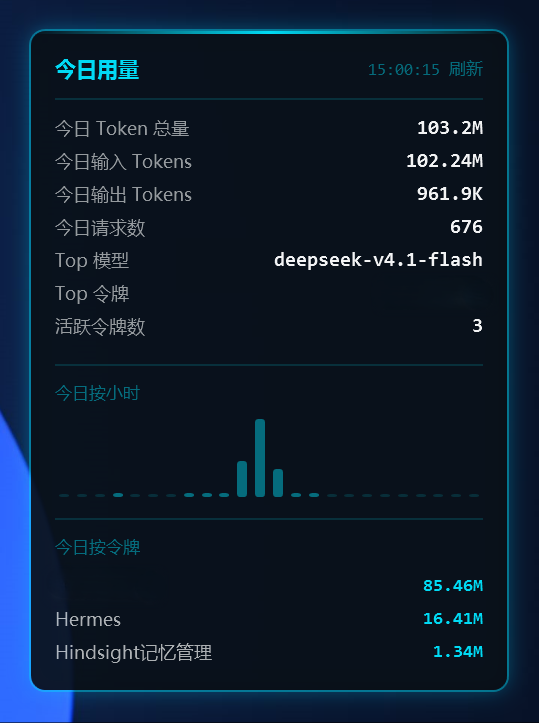

# New API Orb

> 一个贴在 Windows 桌面上的悬浮球，实时显示你的 [new-api](https://github.com/QuantumNous/new-api) 网关今天消耗了多少 Token。
>
> A lightweight always-on-top desktop orb for Windows that shows your new-api gateway's token usage in real time.

与 new-api 官方无关，仅通过其管理接口读取数据。

## 效果预览

<p align="center">
  
  &nbsp;&nbsp;
  
</p>

<p align="center">
  <sub>左：收起态悬浮球　·　右：展开态明细卡片</sub>
</p>

## 功能

- **收起态** —— 圆形悬浮球，显示一个主指标（默认「今日 Token 总量」）；主指标下方可再选一个副指标
  （环比昨日 / 近 1 条或 3 条流式速度 / 近 1 条或 3 条流式耗时），球体带刻度环与缓慢流动的光效
- **展开态** —— 明细卡片，字段可自由勾选、**按住手柄拖动排序**，内置 18 个可选字段：
  今日 Token 总量 / 今日输入 / 今日输出 / 今日缓存 / 今日请求数 / 今日消耗额度 / Top 模型 /
  Top 令牌 / 活跃令牌数 / 平均耗时 / 近 1 条或 3 条流式速度 / 近 1 条或 3 条流式耗时 /
  账户余额 / 累计已用 / 总请求数 / 环比昨日
- **设置即所改** —— 面板里选指标、勾字段、拖手柄排序、拉滑块，悬浮球与卡片即时跟着变；
  点「保存并应用」才落盘，点「取消」自动回滚
- **今日按小时** 柱状图
- **今日按令牌** 用量排行
- **贴边自动隐藏** —— 拖到屏幕边缘自动缩成一个发光小球，鼠标移入恢复
- **位置记忆** —— 自动记住停靠位置，下次启动回到原处
- **系统托盘** —— 显示/隐藏、立即刷新、设置、窗口置顶、开机自启、退出
- 零第三方 NuGet 依赖（WPF + WinForms 托盘图标），可发布为单文件

## 使用

### 直接运行

到 [Releases](https://github.com/jianji112/newapi-orb/releases) 下载 `NewApiOrb-vX.Y.Z-win-x64.zip`，解压后双击 `NewApiOrb.exe`。

**免安装、免装 .NET 运行时**（运行时已打包进单文件）。

首次启动会自动弹出设置窗口，填两项即可：

| 字段 | 说明 |
|---|---|
| 网关地址 | 你的 new-api 地址，例如 `http://newapi.example.com` 或 `http://localhost:3000` |
| 系统访问令牌 | new-api 后台 →「个人设置」→「系统访问令牌」，生成或复制 |

> ⚠️ 必须用**系统访问令牌**，不能用 `sk-` 开头的 API Key —— 后者调管理接口会返回 401。

### 操作方式

| 操作 | 效果 |
|---|---|
| 单击球 | 展开 / 收起明细卡片 |
| 拖拽球 | 移动位置 |
| 拖到屏幕边缘 | 自动贴边隐藏；鼠标移入球上恢复 |
| 鼠标移开 | 卡片自动收起 |
| 右键球 | 菜单：立即刷新 / 设置 / 置顶 / 开机自启 / 退出 |
| 托盘图标 | 左键显示/隐藏悬浮球，右键同菜单 |

## 数据来源

程序读取 new-api 的 `/api/log/self` **逐条调用日志**，而不是 `/api/data/self` 的近似统计 ——
后者实测会少算请求数与 Token 数（会导致「今日输入 > 今日总量」这类矛盾展示），
用逐条日志聚合出来的数字与后台「日志」页面完全一致。

| 接口 | 用途 |
|---|---|
| `GET /api/log/self?p=&page_size=&type=0&start_timestamp=&end_timestamp=` | 今日与昨日逐条日志；`page_size` 服务端硬上限 100，程序按 4 路并发分页拉取 |
| `GET /api/user/self` | 账户余额、累计已用、总请求数 |

刷新间隔默认 30 秒，可在设置里修改。网络抖动会自动重试，失败会落日志而不会中断刷新循环。

## 从源码构建

需要 .NET 10 SDK。

```bash
# 普通构建
dotnet build -c Release

# 自包含单文件（分发给别人用这个）
dotnet publish -c Release -r win-x64 --self-contained true \
  -p:PublishSingleFile=true \
  -p:IncludeNativeLibrariesForSelfExtract=true \
  -p:EnableCompressionInSingleFile=true \
  -p:DebugType=none \
  -o dist/NewApiOrb
```

## 项目结构

```
src/NewApiOrb/
├─ MainWindow.xaml(.cs)      悬浮球 / 明细卡片 / 贴边与展开动画
├─ SettingsWindow.xaml(.cs)  设置面板
├─ App.xaml(.cs)             启动、托盘、深色主题资源
├─ Models/                   配置、字段目录、数据快照
├─ Services/                 配置读写、new-api 客户端、采集服务、开机自启
└─ Utils/                    时间与格式化辅助
```

## 系统要求

Windows 10 / 11 64 位。

## 配置与日志位置

| 用途 | 路径 |
|---|---|
| 配置 | `%APPDATA%\NewApiOrb\config.json` |
| 错误日志 | `%APPDATA%\NewApiOrb\last-error.log` |

删掉 `config.json` 会重新走一次首次启动流程。

如果不想每次手填，也可以在 `%USERPROFILE%\.newapi-orb.env` 里预置三行，首次启动会自动读取：

```env
NEWAPI_BASE_URL=http://localhost:3000
NEWAPI_ACCESS_TOKEN=你的系统访问令牌
NEWAPI_USER_ID=1
```

## 常见问题

**球上显示「离线」**
网关地址或令牌填错了，或者这台机器访问不到网关。错误详情见 `last-error.log`。

**提示「已保护你的电脑 / 未知发布者」**
程序没有代码签名。点「更多信息」→「仍要运行」。

**调试**
设环境变量 `ORB_TRACE=1` 启动，会把每次出站请求的路径、状态码、耗时写进
`%APPDATA%\NewApiOrb\fetch.log`；`ORB_NOFX=1` 剥掉模糊效果，用于定位掉帧来源。
